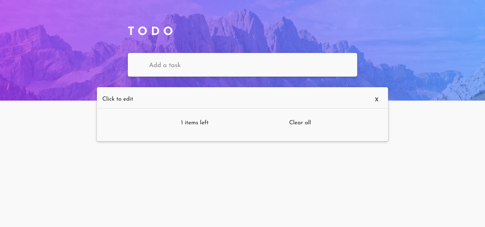

# Todo List
A web app Todo list builded with vanilla js.

## Table of contents

- [Overview](#overview)
  - [Screenshot](#screenshot)
  - [Links](#links)
- [My process](#my-process)
  - [Built with](#built-with)
  - [What I learned](#what-i-learned)
- [Author](#author)

## Overview

### The challenge

-My fist crud project based on frontentmentor Todo list challenge

### Screenshot

### Links

- Solution URL: [Github repository](https://github.com/RafaelGLeal/Todo-List)
- Live Site URL: [Live Site](https://rafaelgleal.github.io/Todo-List/)

### Built with

- Semantic HTML5 markup
- CSS custom properties
- Sass preprocessor
- Javascript

### What I learned

- I had more practice with dom manipulation and how to make a crud.

## Author

- Website - [Rafael G. Leal](https://github.com/RafaelGLeal)
